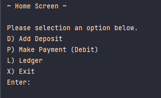
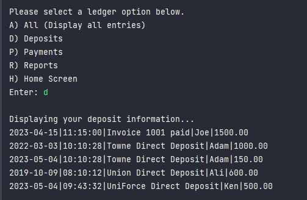
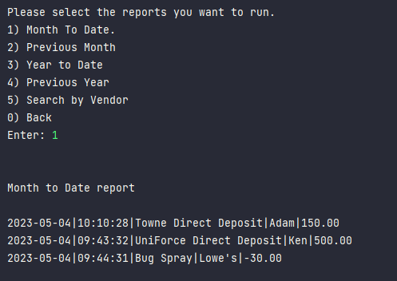
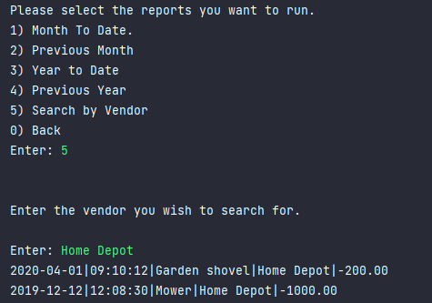

# Accounting Ledger

This console application allows user to search a list of all transactions made. User can either add in a deposit or
payments. If they would like to view all entries on their ledger user have the options to:

1. Display all entries that were deposit into the account.
2. Display only the payments
3. Reports - this will show a new screen which will allow user to run pre-defined report or run custom search

Within the Report menu user have the options to run reports by:

1. Month To Date
2. Previous Month
3. Year to Date
4. Previous Year
5. Search by Vendor

## Interesting Code
This code allows user to enter in a vendor they wish to search for. It will then load a list of transactions and
iterates over each transaction in the list if the vendor matches the search criteria. If a transaction is found
it prints it to the console. If no transaction is found the 'matchFound' variable remains false.

```java
 System.out.print("Enter: ");
        scanner.nextLine();
        String searchVendor = scanner.nextLine();

        ArrayList<Account> accounts = loadTransactions();
        boolean matchFound = false;

        for (var account : accounts)
        {
            if (account.getVendor().equalsIgnoreCase(searchVendor))
            {
                System.out.println(account);
                matchFound = true;
            }
        }

        if (!matchFound)
        {
            System.out.println("No transactions found for vendor " + searchVendor);
        }
```

### Home Screen



### List deposits made



### Show Report for Current Month



### Search by Vendor

